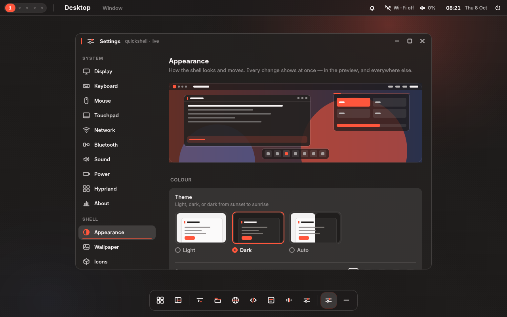
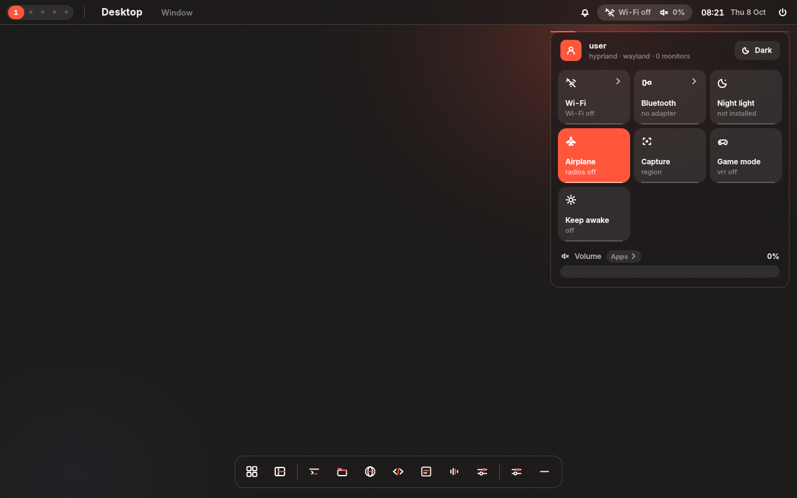
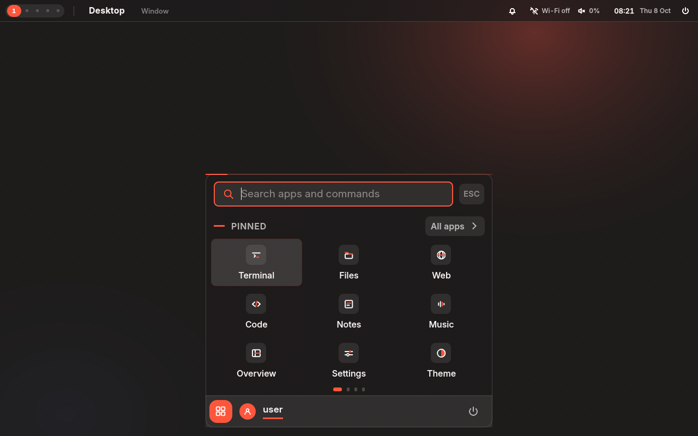
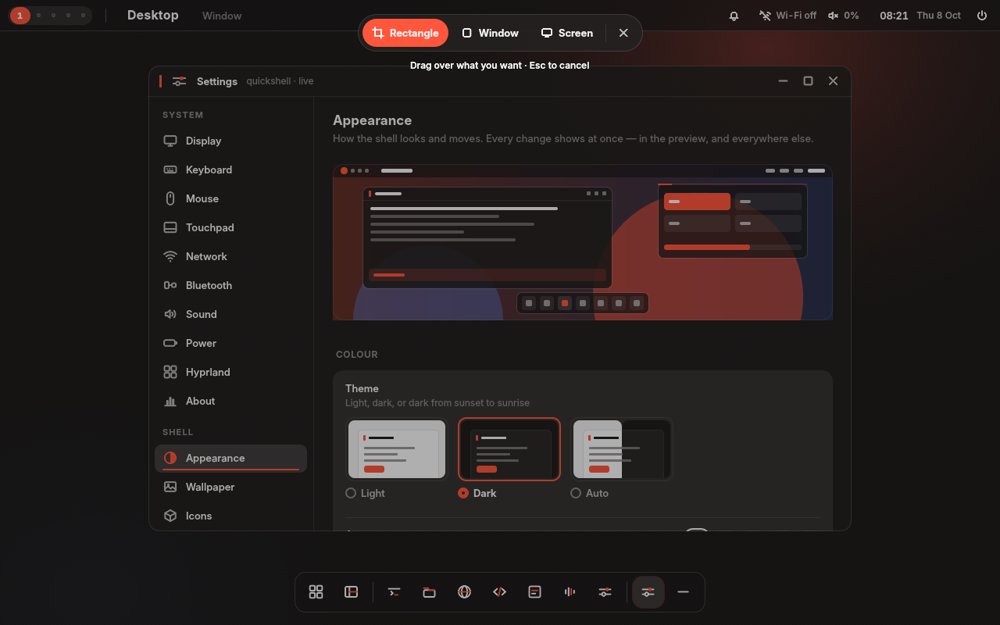
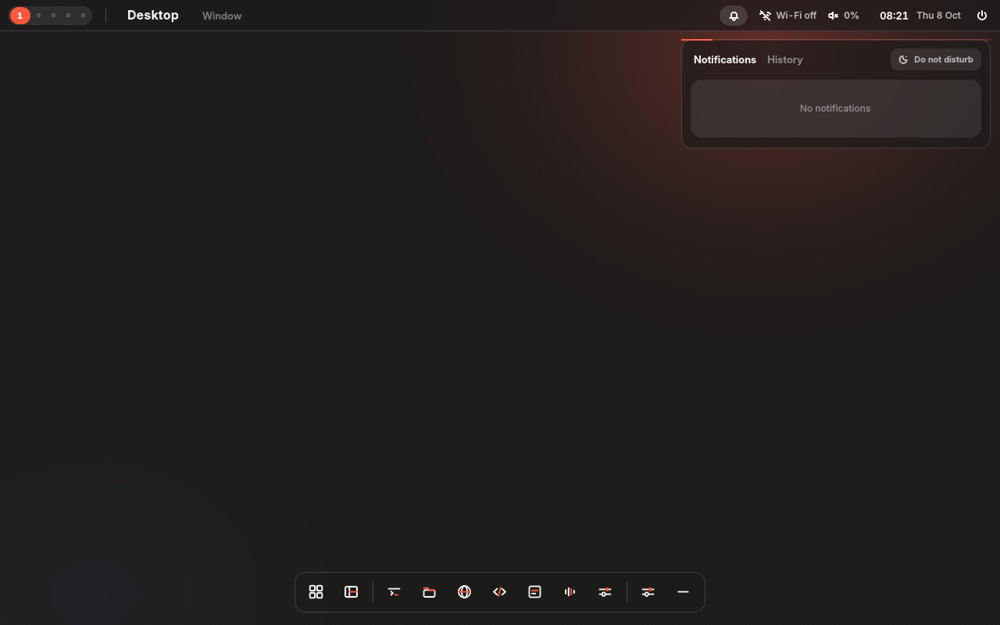
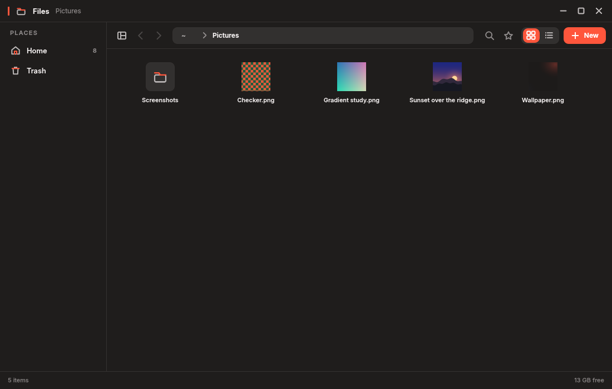
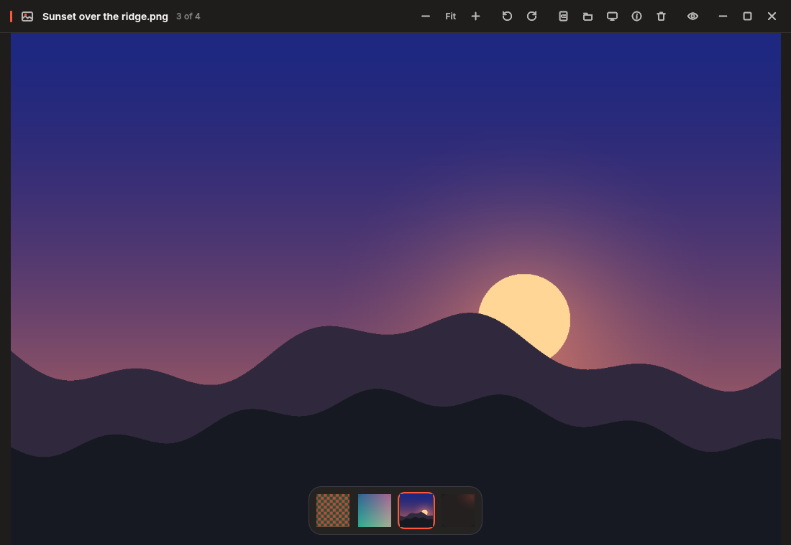
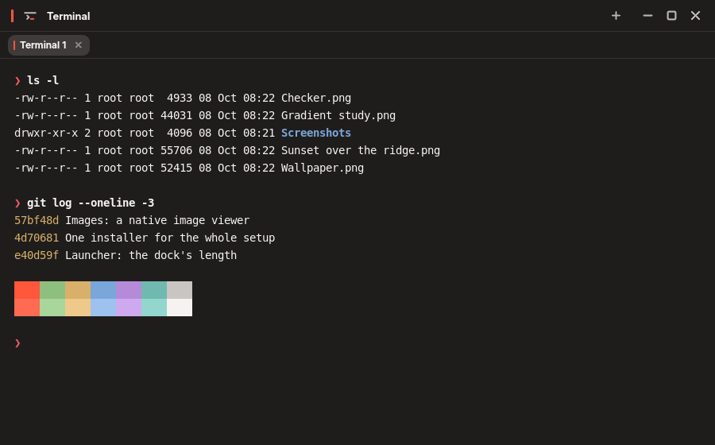
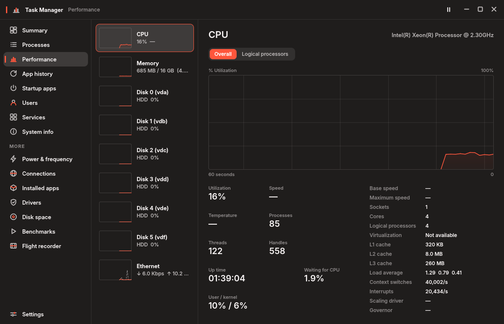

# Hyprshell

A Hyprland desktop built from a single design: a Quickshell shell, a matching
terminal, a file manager, an image viewer, a task manager, an email app, a
browser and a login screen.

    shell/    the shell — bar, dock, launcher, panels, settings, lock screen,
              plus the Hyprland and kitty configuration it assumes
    term/     the terminal
    files/    the file manager, a standalone Qt 6 application
    images/   Images — the image viewer, and what opens pictures
    tasks/    the task manager — processes, performance, services, startup
    mail/     Mail — Gmail, Outlook and IMAP, with its own background service
    browser/  Hyprshell Browser — Firefox's engine with the design's interface
    greeter/  the login screen, run by greetd, in your theme

<table>
<tr>
<td> Control center</td>
<td> Launcher, grown out of the dock</td>
</tr>
<tr>
<td> Super+Shift+S: the screen frozen to choose a shot</td>
<td> Notifications</td>
</tr>
<tr>
<td> Files</td>
<td> Images</td>
</tr>
<tr>
<td> Terminal</td>
<td> Task manager</td>
</tr>
</table>

Taken in a headless test compositor without a GPU, so without the blur
behind the bar, dock and panels that Hyprland draws on a real machine.

## Installing

    ./install.sh

asks which parts you want: a checklist with everything but the login screen
ticked, and an option to install the packages they need first. Or say it on
the command line:

    ./install.sh --all --deps          everything, packages included
    ./install.sh --shell               just the shell
    ./install.sh --shell-only          the shell, keeping your Hyprland config
    ./install.sh --terminal --files    any mix: --shell --terminal --files
                                       --images --mail --tasks --browser
                                       --greeter
    ./install.sh --check --all         what each part is missing, changing nothing
    ./install.sh --list                what is installed already

`--deps` uses pacman on Arch and CachyOS, and paru or yay for anything (such
as quickshell) that is only in the AUR. A part that fails does not stop the
others; the summary at the end says how each went.

Each part also has its own README and its own `install.sh`, which still work
on their own. The shell works without the file manager; the file manager
works without the shell, and picks up the shell's theme when it is there.
